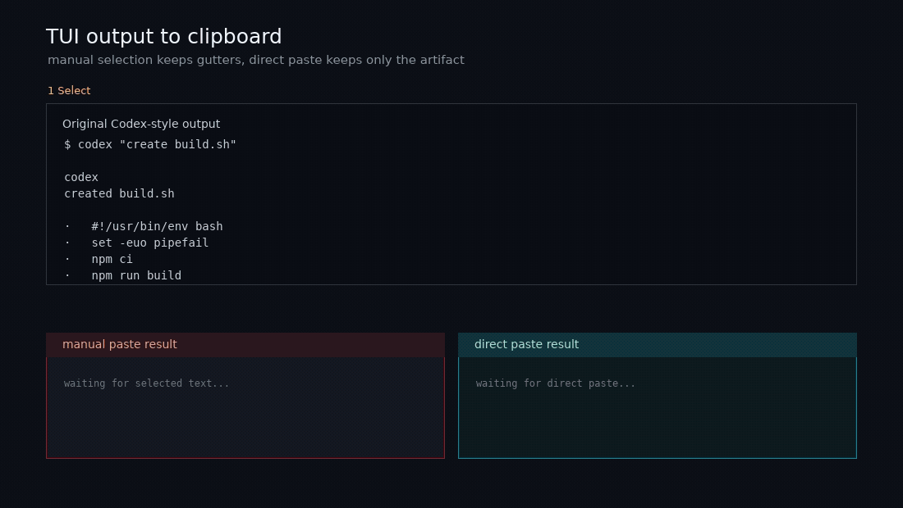

<h1 align="center">Clipboard Output Skill</h1>

<p align="center">
  <strong>A Codex skill that puts exact generated text on the clipboard instead of making users copy from a terminal UI.</strong>
</p>

<p align="center">
  <a href="./README_zh.md">中文</a> · <a href="#quick-start">Quick Start</a> · <a href="#usage">Usage</a> · <a href="#verification">Verification</a>
</p>

<p align="center">
  
  
  
  
</p>

<p align="center">
  
</p>

---

## What is Clipboard Output Skill?

Clipboard Output Skill is a personal Codex skill for generated text that needs to be pasted elsewhere. It is designed for scripts, config snippets, prompts, JSON, Markdown, commands, issue bodies, release notes, and other exact multi-line artifacts.

The boundary is intentional: the skill helps decide what should go on the clipboard, while the bundled Python helper performs the actual cross-platform copy operation. It is not a general clipboard manager and does not store clipboard history.

## Features

- Copies exact generated artifacts to the system clipboard to avoid terminal UI selection problems.
- Writes durable multi-file outputs to real files and copies only the most useful entrypoint, path, command, or manifest.
- Refuses to copy likely secrets by default, including API keys, tokens, passwords, and private keys.
- Supports dry-run backend detection without changing the clipboard.
- Includes unit tests for input-source handling, secret detection, and native Windows clipboard API setup.

## Tech Stack

| Layer | Choice |
| --- | --- |
| Skill format | Codex personal skill (`SKILL.md`) |
| Helper runtime | Python 3.12+ standard library |
| Clipboard backends | WSL/PowerShell, `clip.exe`, `pbcopy`, `wl-copy`, `xclip`, `xsel`, Termux, native Windows |
| Tests | Python `unittest` |
| CI | GitHub Actions |

## Quick Start

### Agent-assisted installation

If your coding agent supports installing skills from a GitHub URL, you can give it this repository URL and ask it to install the skill:

```text
https://github.com/Chlience/clipboard-output-skill
```

Example prompt:

```text
Install the Codex skill from https://github.com/Chlience/clipboard-output-skill
```

### Manual installation

Install as a Codex personal skill:

```bash
mkdir -p ~/.agents/skills
cp -R skills/clipboard-output ~/.agents/skills/clipboard-output
```

Restart or reload Codex so the new skill metadata is picked up.

Check that the helper can read the skill file and detect a clipboard backend:

```bash
python3 ~/.agents/skills/clipboard-output/scripts/copy_text.py \
  --file ~/.agents/skills/clipboard-output/SKILL.md \
  --dry-run
```

## Usage

Copy from a file:

```bash
python3 ~/.agents/skills/clipboard-output/scripts/copy_text.py --file ./script.bat
```

Copy explicit short text:

```bash
python3 ~/.agents/skills/clipboard-output/scripts/copy_text.py --text "hello"
```

Copy from standard input:

```bash
printf '%s\n' "hello" | python3 ~/.agents/skills/clipboard-output/scripts/copy_text.py --stdin
```

Allow copying content that looks sensitive only after an explicit decision:

```bash
python3 ~/.agents/skills/clipboard-output/scripts/copy_text.py --file ./.env --allow-sensitive
```

## Clipboard Backends

The helper tries the most appropriate backend for the current platform:

| Environment | Backend |
| --- | --- |
| WSL | PowerShell `Set-Clipboard`, then `clip.exe` fallback |
| macOS | `pbcopy` |
| Linux Wayland | `wl-copy` |
| Linux X11 | `xclip` or `xsel` |
| Termux | `termux-clipboard-set` |
| Native Windows Python | Win32 clipboard API via `ctypes` |

Clipboard access can fail in restricted sandboxes, remote SSH sessions, headless Linux, or WSL instances without Windows interop.

## Output Rules

For one generated artifact, the skill copies the artifact itself. For multiple generated files, it creates the real files first and copies one useful payload: an entrypoint file, directory path, archive path, run command, or short manifest.

The skill only combines multiple files into one clipboard payload when the user explicitly asks for a single pasteable text block.

## Safety

The clipboard is shared system state. Treat it as unsuitable for secrets by default.

The helper refuses likely sensitive content unless `--allow-sensitive` is provided. Detection is heuristic, so users should still avoid putting secrets, private keys, production logs, customer data, and other confidential material on the clipboard.

## Verification

Run from the repository root:

```bash
PYTHONDONTWRITEBYTECODE=1 python3 -m unittest discover \
  -s skills/clipboard-output/tests \
  -p 'test_*.py'

PYTHONDONTWRITEBYTECODE=1 python3 -m unittest discover \
  -s tests \
  -p 'test_*.py'
```

Parse the helper script without writing `__pycache__` files:

```bash
python3 -B -c "import ast, pathlib; ast.parse(pathlib.Path('skills/clipboard-output/scripts/copy_text.py').read_text())"
```

Run a smoke check without touching the clipboard:

```bash
python3 skills/clipboard-output/scripts/copy_text.py \
  --file skills/clipboard-output/SKILL.md \
  --dry-run
```

## Documentation

- [Skill instructions](skills/clipboard-output/SKILL.md)
- [Clipboard helper](skills/clipboard-output/scripts/copy_text.py)
- [Unit tests](skills/clipboard-output/tests/test_copy_text.py)
- [Demo renderer](demo/README.md)
